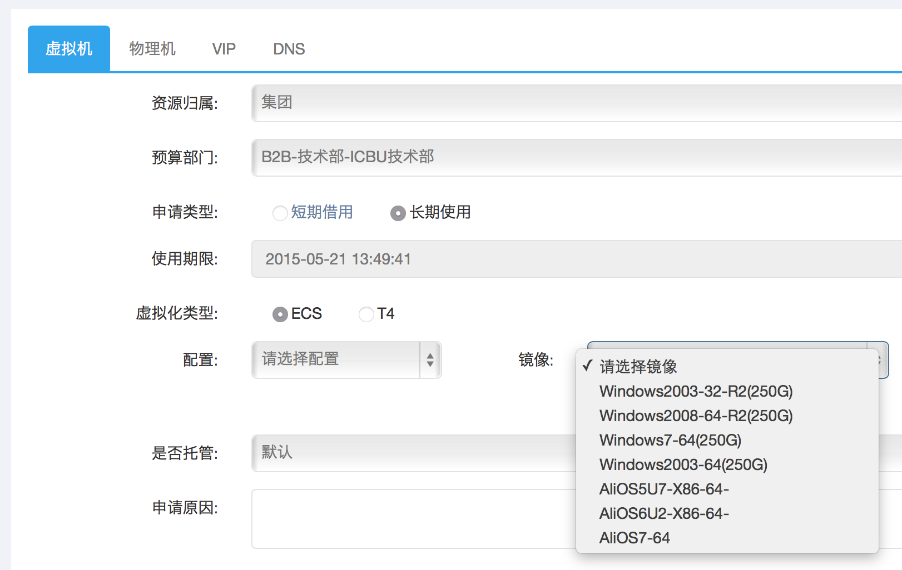

创建基于AliOS7·Docker1.6的模板

### 1. AliOS7
AliOS7的虚拟机模板目前已经公开，这是阿里第一个支持Docker的版本，从这个角度看其价值非常重大。

从此，我们可以在虚拟机上玩Docker了！

#### 申请虚拟机
目前运维服务已经提供AliOS7的镜像申请，示例如下。

http://kfc.alibaba-inc.com/v3/#/resource/new/vm



#### 验证环境
经过审批后，我们便拿到了新鲜出炉的AliOS7虚拟机。验证下系统环境，示例如下。

```
$cat /etc/redhat-release
Alibaba Group Enterprise Linux Server release 7.0 (Maipo)
```

```
$uname -a
Linux e10069196204.zmf 3.10.0-123.4.2_2.alios7.x86_64 #1 SMP Wed Jan 14 16:43:34 CST 2015 x86_64 x86_64 x86_64 GNU/Linux
```

这个内核虽然小于3.18，但是不影响余文的测试。

### 2. Docker

#### 安装docker

最直接的安装方式是通过yum安装，但AliOS7源中拿到的Docker是1.3.2版本。如果该版本足够使用，请忽略升级部分。

```
$sudo yum install -y docker
```

```
$docker version
Client version: 1.3.2
Client API version: 1.15
Go version (client): go1.3.3
Git commit (client): 39fa2fa/1.3.2
OS/Arch (client): linux/amd64
2015/04/21 10:08:04 Get http:///var/run/docker.sock/v1.15/version: dial unix /var/run/docker.sock: no such file or directory
```

我们看输出的最后一行，docker的daemon并没有正常启动。原因接下来会讲。

#### 升级docker
升级Docker的原理是使用新的二进制文件替换旧的。因此，我们首先确定Docker的二进制路径。示例如下。

```
$whereis docker
docker: /usr/bin/docker /etc/docker /usr/libexec/docker /usr/share/man/man1/docker.1.gz

$which docker
/usr/bin/docker
```

然后下载最新的Docker二进制文件并替换老的。示例如下。

```
$wget https://get.docker.io/builds/Linux/x86_64/docker-latest -O docker
$sudo mv -f docker /usr/bin/docker
$sudo chmod +x /usr/bin/docker
```

#### 一个坑
此时，我们启动docker daemon会发现TLS错误。这需要修改docker的启动参数OPTIONS，将默认的TLS禁掉。示例如下。

```
$sudo nano /etc/sysconfig/docker
# OPTIONS=--selinux-enabled -H fd://
```

注意了，此时docker daemon依然是启不来的！这是一个坑，添。
原因是docker0启动不了。有人说修改/etc/network/interface，但是当我们在AliOS7中打开该文件时，空空如也（这个是debian系修改网络配置的地方）。
但，基本定位了问题，是docker0无法启动导致daemon启动不了。

如下的解决办法未必是官方认同的，但确实奏效。

```
sudo route del -net 172.16.0.0 netmask 255.240.0.0
```

秒懂的同学嘴角露出了不屑的微笑…… 刨根问底的同学去搜下AliOS7对网络做了什么吧（发完本文，得到了老阿里的帮助，挖了挖坟，考古结果是历史包袱导致需要这样做）。

现在我们通过systemd的命令来启动和管理docker daemon。

```
$sudo systemctl enable docker.service
ln -s '/usr/lib/systemd/system/docker.service' '/etc/systemd/system/multi-user.target.wants/docker.service'
```

```
$sudo systemctl start docker.service

$sudo systemctl status docker.service
docker.service - Docker Application Container Engine
   Loaded: loaded (/usr/lib/systemd/system/docker.service; enabled)
   Active: active (running) since Tue 2015-04-21 11:15:48 CST; 18s ago
     Docs: http://docs.docker.com
 Main PID: 2451 (docker)
   CGroup: /system.slice/docker.service
           └─2451 /usr/bin/docker -d

Apr 21 11:15:47 e10069196204.zmf docker[2451]: time="2015-04-21T11:15:47+08:00" level=warning msg="Udev sync is not supported. This will lead to une...d errors"
Apr 21 11:15:47 e10069196204.zmf docker[2451]: time="2015-04-21T11:15:47+08:00" level=info msg="+job init_networkdriver()"
Apr 21 11:15:47 e10069196204.zmf docker[2451]: time="2015-04-21T11:15:47+08:00" level=info msg="-job init_networkdriver() = OK (0)"
Apr 21 11:15:48 e10069196204.zmf docker[2451]: time="2015-04-21T11:15:48+08:00" level=info msg="Loading containers: start."
Apr 21 11:15:48 e10069196204.zmf docker[2451]: time="2015-04-21T11:15:48+08:00" level=info msg="Loading containers: done."
Apr 21 11:15:48 e10069196204.zmf docker[2451]: time="2015-04-21T11:15:48+08:00" level=info msg="docker daemon: 1.6.0 4749651; execdriver: native-0.2...cemapper"
Apr 21 11:15:48 e10069196204.zmf docker[2451]: time="2015-04-21T11:15:48+08:00" level=info msg="+job acceptconnections()"
Apr 21 11:15:48 e10069196204.zmf docker[2451]: time="2015-04-21T11:15:48+08:00" level=info msg="-job acceptconnections() = OK (0)"
Apr 21 11:15:48 e10069196204.zmf docker[2451]: time="2015-04-21T11:15:48+08:00" level=info msg="Daemon has completed initialization"
Apr 21 11:15:48 e10069196204.zmf systemd[1]: Started Docker Application Container Engine.
Hint: Some lines were ellipsized, use -l to show in full.
```

此时，我们再次测试版本，可以看到docker和docker daemon的版本信息。

```
$docker version
Client version: 1.6.0
Client API version: 1.18
Go version (client): go1.4.2
Git commit (client): 4749651
OS/Arch (client): linux/amd64
Server version: 1.6.0
Server API version: 1.18
Go version (server): go1.4.2
Git commit (server): 4749651
OS/Arch (server): linux/amd64
```

到此，我们的Docker环境成功set up！

### 3. 制作Java8镜像
接下来我们在AliOS7中，实战第一个Docker1.6的镜像和容器。如下，以Java8为例。

#### 编写Dockerfile

```
vi dockerfile_java8
```
```
#
# Oracle Java 8 Dockerfile
#
# https://github.com/dockerfile/java
# https://github.com/dockerfile/java/tree/master/oracle-java8
#

# Pull base image.
FROM dockerfile/ubuntu

# Install Java.
RUN \
  echo oracle-java8-installer shared/accepted-oracle-license-v1-1 select true | debconf-set-selections && \
  add-apt-repository -y ppa:webupd8team/java && \
  apt-get update && \
  apt-get install -y oracle-java8-installer && \
  rm -rf /var/lib/apt/lists/* && \
  rm -rf /var/cache/oracle-jdk8-installer


# Define working directory.
WORKDIR /data

# Define commonly used JAVA_HOME variable
ENV JAVA_HOME /usr/lib/jvm/java-8-oracle

# Define default command.
CMD ["bash"]
```

#### 构建镜像
新的Docker版本支持在build时对dockerfile文件的指定。

```
[lu.hl@e10069196204.zmf /home/lu.hl]
$docker build -t feuyeux/java8 -f dockerfile_java8 .
```

构建完毕后，我们列出当前镜像。

```
$docker images
REPOSITORY          TAG                 IMAGE ID            CREATED             VIRTUAL SIZE
feuyeux/java8       latest              221bc6f1ba4f        14 seconds ago      765.8 MB
dockerfile/ubuntu   latest              b87155bee962        4 weeks ago         410.1 MB
```

#### 运行容器

```
$docker run -ti --rm feuyeux/java8 java -version
java version "1.8.0_45"
Java(TM) SE Runtime Environment (build 1.8.0_45-b14)
Java HotSpot(TM) 64-Bit Server VM (build 25.45-b02, mixed mode)
```
