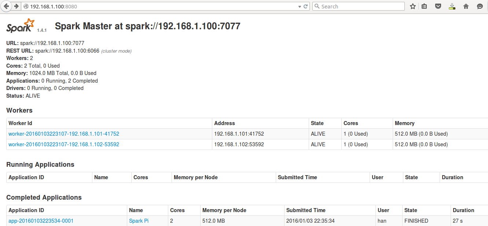

# spark standalone on CentOS6.7

## 1. overview
|IP|Hostname|Service|
|:--|:--|:--|
|192.168.1.100|spark1|spark-master|
|192.168.1.101|spark2|spark-worker|
|192.168.1.102|spark3|spark-worker|

## 2. host setting
### disable firewall

```
sudo service iptables stop
sudo chkconfig iptables off
```

### environments
sudo nano  /etc/profile

```
export JAVA_HOME=/usr/lib/jvm/jre-1.8.0-openjdk.x86_64
export SCALA_HOME=/opt/scala-2.11.7/
export PATH=$SCALA_HOME/bin:$PATH
export JRE_HOME=$JAVA_HOME/jre
export PATH=$PATH:$JAVA_HOME/bin
export CLASSPATH=.:$JAVA_HOME/lib/dt.jar:$JAVA_HOME/lib/tools.jar
```

### hosts
sudo nano /etc/hosts

```
127.0.0.1   localhost spark3
::1         localhost spark3
192.168.1.100 spark1
192.168.1.101 spark2
192.168.1.102 spark3
```

### dns
sudo nano /etc/resolv.conf

```
nameserver 8.8.8.8
```
### hostname
sudo nano /etc/sysconfig/network

```
NETWORKING=yes
HOSTNAME=spark3
```

### networking
sudo nano /etc/sysconfig/network-scripts/ifcfg-eth0

```
DEVICE="eth0"
BOOTPROTO="static"
IPV6INIT="yes"
NM_CONTROLLED="yes"
ONBOOT="yes"
TYPE="Ethernet"
IPADDR="192.168.1.102"
NETMASK="255.255.255.0"
GATEWAY="192.168.1.1"
DNS1="8.8.8.8"
```

## 3. ssh
```
ssh-keygen

ssh-copy-id -i .ssh/id_rsa.pub han@spark1
ssh-copy-id -i .ssh/id_rsa.pub han@spark2
ssh-copy-id -i .ssh/id_rsa.pub han@spark3
```

## 4. configuration

On spark1:

nano /opt/spark-1.4.1-bin-cdh4/conf/slaves

```
spark2
spark3
```

On spark2/spark3:

nano /opt/spark-1.4.1-bin-cdh4/conf/spark-env.sh

```
export SPARK_MASTER_IP=192.168.1.100
export MASTER=spark://192.168.1.100:7077
```

## 5. running

ON spark1:

```
cd spark-1.4.1-bin-cdh4/
sbin/start-all.sh
```

## 6. testing
```
bin/spark-class org.apache.spark.deploy.worker.Worker spark://spark1:7077
```

```
bin/run-example org.apache.spark.examples.SparkPi 13 spark://spark1:7077
```



2016.1.3
eric han
