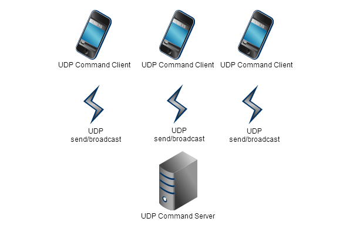
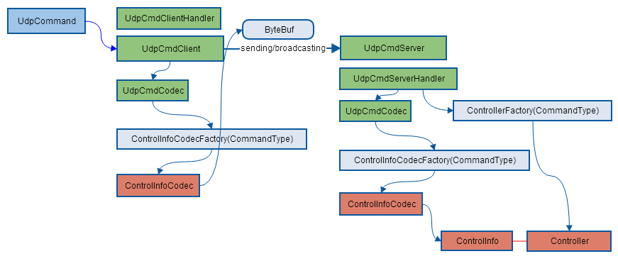
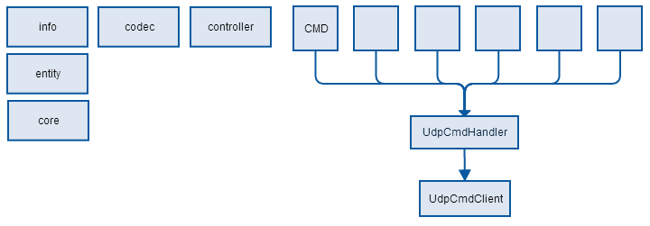
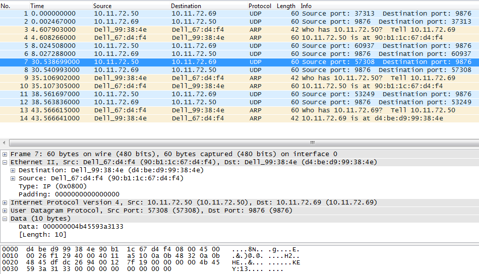

#UDP Command Design#
- build:gradle-1.10
- dependency:netty5.0.0.Alpha1

### 1 network topology ###
UDP Command Server receives Clients' sending or broadcasting message via UDP nio Channel.
When UDP Command Server receives command, it will choose a related controller to process this command.
 

### 2 how does it work ###
1. UDP Command framework works on netty5.1, a nio platform. The client is located on smart device and the server will be deployed on box.

1. The client will broadcast to find the server and when servers give the response, the client will fill them to a list.

1. The client selects one of the list as media server, then send command to it via udp. On server side, there are some controllers to handle the event for the specific command, which is an observer and command design pattern.

1. Both android and iOS command controller given on the client side and it will handle the native low level event and then generate the general command type separately, then send it to server.

### 3 class organization ###
#### 3.1 What we have ####
Firstly, it's an abstract existing to encapsulate the UDP Commands, it's blind to acknowledge what kind of and how many commands in the implementation application.

So:

- The command detail info is located in **info package**, which indicates a kind of specific command.
- Its networking codec is in **codec package**, which is the command's codec, including encode and decode. 
- Its handler in **controller package**, which is the callback method for receiving event.

And **core package** is for nio networking which is a netty-based implementation and the basic event handling. It provides a convenient way for the developer who is extending for a new kind of command.

Finally, **entity package** is for UDP command itself.

Additionally, we provide a command package which has a class UdpCmdHandler to handle all kinds of command and send it to client instance, following Facade design pattern. This is the high level tier to encapsulate the UDP communication.

	.
	├── codec/
	│   ├── ControlInfoCodecFactory.java
	│   ├── ControlInfoCodec.java
	│   └── KeyControlInfoCodec.java
	├── command/
	│   ├── CmdCallback.java
	│   └── UdpCmdHandler.java
	├── controller/
	│   ├── CmdController.java
	│   ├── ControllerFactory.java
	│   ├── JoyPadController.java
	│   ├── KeyController.java
	│   ├── MouseController.java
	│   ├── RemoteControlController.java
	│   ├── TouchPadController.java
	│   └── VolumeController.java
	├── core/
	│   ├── UdpCmdClientContext.java
	│   ├── UdpCmdClientHandler.java
	│   ├── UdpCmdClient.java
	│   ├── UdpCmdCodec.java
	│   ├── UdpCmdServerHandler.java
	│   └── UdpCmdServer.java
	├── entity/
	│   ├── CommandType.java
	│   └── UdpCommand.java
	├── info/
	│   ├── ControlInfo.java
	│   ├── JoyPadInfo.java
	│   ├── KeyControlInfo.java
	│   ├── MouseInfo.java
	│   ├── RemoteControlInfo.java
	│   ├── TouchPadInfo.java
	│   └── VolumeInfo.java

#### 3.2 Command structure ####
UDP Command has two fields, the type is used to generate the codec and controller in the factory method, and the info is the command detail info for controller processing.

	public class UdpCommand implements Serializable {
	    private CommandType type;
	    private ControlInfo controlInfo;

#### 3.3 How to extend for new command ####
As fixable and extensible, we provide type for command and use factory design pattern for **codec** and **controller**. 

To extend for a new command type, it should generate **info**, **codec** and **controller**, as well as extend the **factory method**.  Is there anything else? No plus, since the  basic nio and event handling given by core framework. 

###4 Key Command Implementation###
#### 4.1 info ####

	public class KeyControlInfo implements ControlInfo {
	    private String keyPress;
#### 4.2 codec ####

	public class KeyControlInfoCodec implements ControlInfoCodec {
	    KeyControlInfoCodec() {
	    }
	
	    @Override
	    public byte[] encode(ControlInfo controlInfo) {
	        KeyControlInfo keyControlInfo = (KeyControlInfo) controlInfo;
	        return keyControlInfo.getKeyPress().getBytes();
	    }
	
	    @Override
	    public ControlInfo decode(byte[] buf) {
	        KeyControlInfo keyControlInfo = new KeyControlInfo();
	        keyControlInfo.setKeyPress(new String(buf));
	        return keyControlInfo;
	    }
	}

#### 4.3 controller ####

	public class KeyController implements Controller {
	    private final static Logger logger = LogManager.getLogger(KeyController.class);
	
	    KeyController() {
	
	    }
	
	    @Override
	    public void process(ControlInfo controlInfo) {
	        KeyControlInfo keyControlInfo = (KeyControlInfo) controlInfo;
	        logger.debug("KEY Press is:{}", keyControlInfo.getKeyPress());
	        //......
	    }
	}

### 5 Tests###
### 5.1 udp broadcast test ###
	2014-02-18 10:50:54,327 [o.f.a.i.n.n.u.c.KeyCommandTest] Test Broadcast Command
	2014-02-18 10:50:54,682 [o.f.a.i.n.n.u.c.c.UdpCmdServer] UDP Command Server launched.
	2014-02-18 10:50:54,689 [o.f.a.i.n.n.u.c.c.UdpCmdClient] UDP Command[hello.] has been send.
	2014-02-18 10:50:54,690 [o.f.a.i.n.n.u.c.c.UdpCmdClient] UDP Command has been received on 255.255.255.255.
	2014-02-18 10:50:54,691 [o.f.a.i.n.n.u.c.c.UdpCmdServerHandler] Client[/10.11.72.69:57883] request:'hello.'
	2014-02-18 10:50:54,693 [o.f.a.i.n.n.u.c.c.UdpCmdClientHandler] Server[BJNGDHKZMB3X.ap.thmulti.com 10.11.72.69] response:'handled:hello.'
	2014-02-18 10:50:55,691 [o.f.a.i.n.n.u.c.KeyCommandTest] >>>10.11.72.69

### 5.2 udp send test ###

	2014-02-18 10:48:47,891 [o.f.a.i.n.n.u.c.c.UdpCmdServer] UDP Command Server launched.
	2014-02-18 10:48:48,035 [o.f.a.i.n.n.u.c.c.UdpCmdClient] UDP Command[KEY-0] has been send.
	2014-02-18 10:48:48,037 [o.f.a.i.n.n.u.c.c.UdpCmdServerHandler] Client[/127.0.0.1:57717] request:'KEY-0'
	2014-02-18 10:48:48,048 [o.f.a.i.n.n.u.c.c.UdpCmdClient] UDP Command has been received on 127.0.0.1.
	2014-02-18 10:48:48,098 [o.f.a.i.n.n.u.c.c.KeyController] KEY Press is:0
	2014-02-18 10:48:48,148 [o.f.a.i.n.n.u.c.c.UdpCmdClient] UDP Command[KEY-1] has been send.
	2014-02-18 10:48:48,161 [o.f.a.i.n.n.u.c.c.UdpCmdClientHandler] Server[127.0.0.1 127.0.0.1] response:'handled:KEY-0'
	2014-02-18 10:48:48,162 [o.f.a.i.n.n.u.c.c.UdpCmdServerHandler] Client[/127.0.0.1:57717] request:'KEY-1'
	2014-02-18 10:48:48,162 [o.f.a.i.n.n.u.c.c.UdpCmdClient] UDP Command has been received on 127.0.0.1.
	2014-02-18 10:48:48,162 [o.f.a.i.n.n.u.c.c.KeyController] KEY Press is:1
	2014-02-18 10:48:48,186 [o.f.a.i.n.n.u.c.c.UdpCmdClientHandler] Server[127.0.0.1 127.0.0.1] response:'handled:KEY-1'
	2014-02-18 10:48:48,248 [o.f.a.i.n.n.u.c.c.UdpCmdClient] UDP Command[KEY-2] has been send.
	2014-02-18 10:48:48,248 [o.f.a.i.n.n.u.c.c.UdpCmdServerHandler] Client[/127.0.0.1:57717] request:'KEY-2'
	2014-02-18 10:48:48,248 [o.f.a.i.n.n.u.c.c.UdpCmdClient] UDP Command has been received on 127.0.0.1.
	2014-02-18 10:48:48,249 [o.f.a.i.n.n.u.c.c.KeyController] KEY Press is:2
	2014-02-18 10:48:48,249 [o.f.a.i.n.n.u.c.c.UdpCmdClientHandler] Server[127.0.0.1 127.0.0.1] response:'handled:KEY-2'
	2014-02-18 10:48:48,348 [o.f.a.i.n.n.u.c.c.UdpCmdClient] UDP Command[KEY-3] has been send.
	2014-02-18 10:48:48,348 [o.f.a.i.n.n.u.c.c.UdpCmdServerHandler] Client[/127.0.0.1:57717] request:'KEY-3'
	2014-02-18 10:48:48,348 [o.f.a.i.n.n.u.c.c.UdpCmdClient] UDP Command has been received on 127.0.0.1.
	2014-02-18 10:48:48,348 [o.f.a.i.n.n.u.c.c.KeyController] KEY Press is:3
	2014-02-18 10:48:48,349 [o.f.a.i.n.n.u.c.c.UdpCmdClientHandler] Server[127.0.0.1 127.0.0.1] response:'handled:KEY-3'
	2014-02-18 10:48:48,448 [o.f.a.i.n.n.u.c.c.UdpCmdClient] UDP Command[KEY-4] has been send.
	2014-02-18 10:48:48,448 [o.f.a.i.n.n.u.c.c.UdpCmdServerHandler] Client[/127.0.0.1:57717] request:'KEY-4'
	2014-02-18 10:48:48,449 [o.f.a.i.n.n.u.c.c.UdpCmdClient] UDP Command has been received on 127.0.0.1.
	2014-02-18 10:48:48,449 [o.f.a.i.n.n.u.c.c.KeyController] KEY Press is:4
	2014-02-18 10:48:48,450 [o.f.a.i.n.n.u.c.c.UdpCmdClientHandler] Server[127.0.0.1 127.0.0.1] response:'handled:KEY-4'

### 6 Remote Test###
- **Server: 10.11.72.69**
- **Client: 10.11.72.50**
- **UDP port: 9876**

