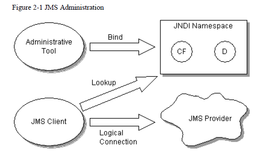
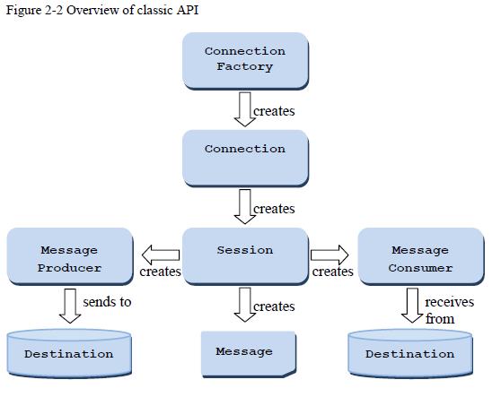
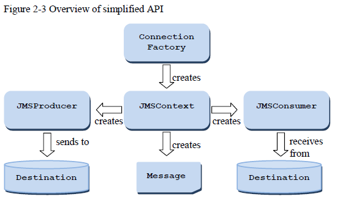
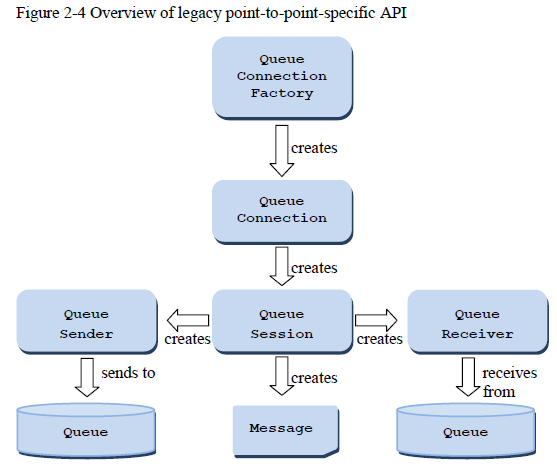
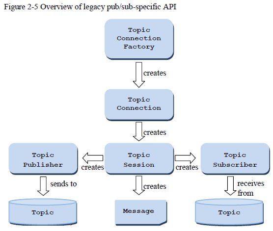

#JMS2 demo#

##Use##
Embedded HornetQ2.4.1.Final

	<hornetq.version>2.4.1.Final</hornetq.version>
    <dependency>
        <groupId>org.hornetq</groupId>
        <artifactId>hornetq-jms-server</artifactId>
        <version>${hornetq.version}</version>
    </dependency>
    <dependency>
        <groupId>org.jboss.spec.javax.jms</groupId>
        <artifactId>jboss-jms-api_2.0_spec</artifactId>
        <version>1.0.0.Final</version>
    </dependency>

##Reference##
- HORNETQ_HOME/examples/jms/embedded
- GLASSFISH4_HOME/docs/javaee-tutorial/examples/jms/simple

##Concept##
### JMS Administration ###

    <connection-factory name="airConnectionFactory" signature="topic">
        <connectors>
            <connector-ref connector-name="in-vm" />
        </connectors>
        <entries>
            <entry name="jms/cf"/>
        </entries>
    </connection-factory>

    <topic name="airTopic">
        <entry name="topic/Air-Topic"/>
    </topic>

    <queue name="airQueue">
        <entry name="queue/Air-Queue"/>
    </queue>

### Classic API interfaces ###

### Simplified API interfaces ###

### Legacy p2p API ###

### Legacy pub/sub API###

